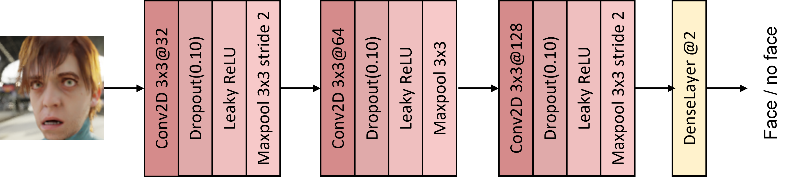
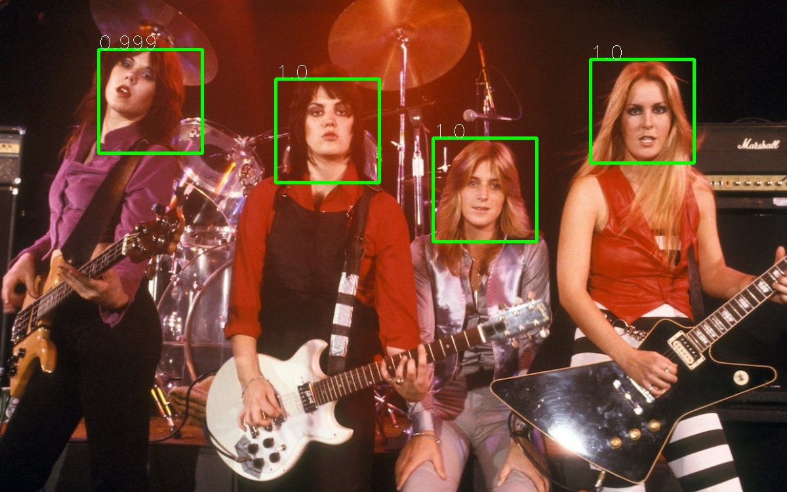
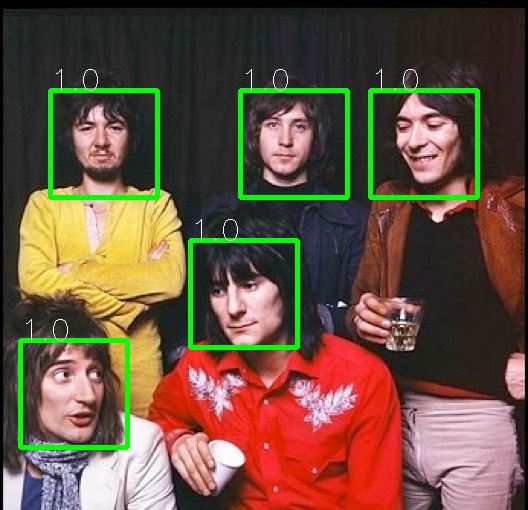
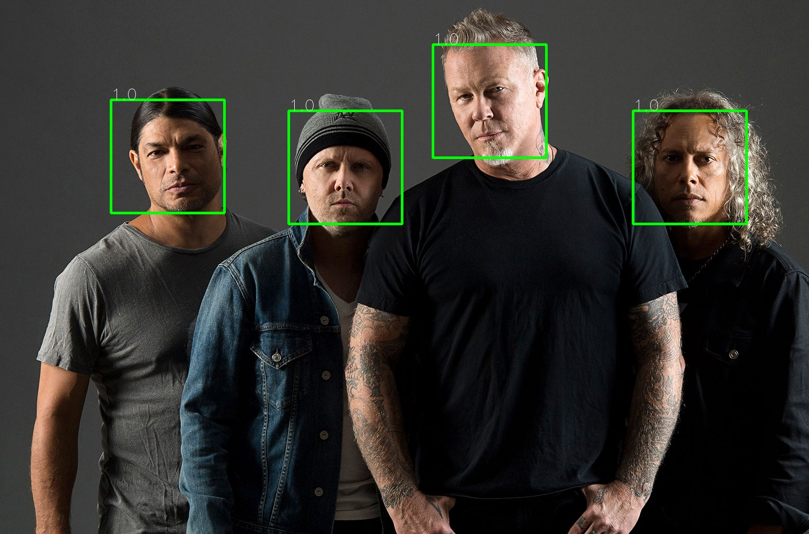

# Face Detector

## Introduction

In this exercise, the task is to design, train, and implement a neural network for face detection in images. The neural network will be evaluated using metrics such as false negatives, false positives, and the F1 score.

## Datasets

The neural network training is conducted using the following datasets:

- **Faces:**
  - A portion of the [DigiFace-1M](https://microsoft.github.io/DigiFace1M/) dataset [1] consisting of 1 million synthetic faces created by Microsoft.
  - The [LFW](http://vis-www.cs.umass.edu/lfw/) dataset [2], provided by the University of Massachusetts Amherst.
  - For validation, only faces from the first mentioned dataset are used.

- **Non-Faces:**
  - Various datasets are used for training:
    - A portion of the indoor scene image segmentation dataset [ADE20K](https://groups.csail.mit.edu/vision/datasets/ADE20K/) [3],[4], excluding scenes with people.
    - The [Body Parts](https://www.kaggle.com/datasets/linkanjarad/body-parts-dataset) dataset [5], discarding images with facial parts.
    - The [Geo Fossils-I](https://www.zenodo.org/record/7510741#.ZDfkf3ZBw2x) dataset [6] with synthetic fossil images.
    - The [HumanWrist](https://www.kaggle.com/datasets/dataclusterlabs/human-wrist-dataset) dataset [7] with images of human wrists.
    - The [Music Instruments](https://www.kaggle.com/datasets/lasaljaywardena/music-instrument-images-dataset?resource=download) dataset [8] containing images of musical instruments.
    - The [Landscape color and gray](https://www.kaggle.com/datasets/theblackmamba31/landscape-image-colorization) dataset [9] with black and white as well as color landscape images.
    - The [Color Dataset](https://www.kaggle.com/datasets/adikurniawan/color-dataset-for-color-recognition) dataset [10] with color images.
    - Finally, the [Hand Gestures](https://www.dlsi.ua.es/~jgallego/datasets/gestures/) dataset [11], consisting of images of hand gestures in natural scenes.

For each image in the non-faces datasets, 16 random patches are extracted, with 4 from a recursively downsampled version of the original image. This is done to increase the number of samples and establish a 30%-70% ratio of faces to non-faces data. In total, the used dataset is distributed as follows:

- **Training:**
  - Faces: 307,245
  - Non-faces: 716,035

- **Validation:**
  - Faces: 25,128
  - Non-faces: 25,312

For each training image, the following data augmentation techniques are applied using the Albumentation library [12]:

- Downsampling to a resolution of 32x32 pixels.
- Random changes in brightness and contrast.
- Random gamma correction.
- Dropout in random rectangular regions of the image.
- Random affine transformations: translation, rotation, and scaling.
- Random horizontal flip.
- Standardization with mean (0.485, 0.456, 0.406) and standard deviation (0.229, 0.224, 0.225).

## Neural Network

The architecture consists of a convolutional neural network based on the output network of a Multitask Cascaded Convolutional Networks (MTCNN) architecture and is depicted in Figure \ref{f1}. The expected input image size is 33x33x3 pixels.


*Figure 1: Neural network architecture for the face classification problem.*

## Results

The results obtained on the validation set are presented in Tables \ref{tb1} - \ref{tb2}.

### Table 1: F1 Metric Results on the Validation Set

|            | Precision | Recall | F1-Score |
|------------|-----------|--------|----------|
| Face       | 0.999     | 0.991  | 0.995    |
| Non-face   | 0.991     | 0.999  | 0.995    |
|            |           |        |          |
| Accuracy   |           |        | 0.995    |
| Macro Avg  | 0.995     | 0.995  | 0.995    |

### Table 2: True Positive Rate (FPR) and False Negative Rate (FNR) on the Validation Set

|            | FPR   | FNR   |
|------------|-------|-------|
| Face       | 0.001 | 0.009 |
| Non-face   | 0.009 | 0.001 |

## Inference

The inference process follows this pipeline:

1. Receive an input image.
2. Calculate the extraction window size based on the scaled image size to the minimum size of the extraction pyramid.
3. Calculate the stride size as one-tenth of the window size.
4. Extract all windows in the image for each of the scales given in the extraction pyramid.
5. Apply downsampling to 33x33 and standardization to each window.
6. Apply neural network inference on each window.
7. Calculate a bounding box for each window in the original image resolution for windows with a score above a threshold.
8. Apply Non-Maximum Suppression based on the score and intersection over union between bounding boxes.
9. Draw the surviving bounding boxes and save the final image with face detection.

The scales of the extraction pyramid are [0.8, 0.6, 0.4, 0.2] relative to the original image resolution. The window and stride sizes are implemented according to the 0.2 scale of the image size to use less memory and speed up processing, without compromising face detection in the image. Additionally, the minimum possible window size is set to 33 pixels, and the minimum possible stride is 3 pixels for sufficiently small resolutions.

## Usage of the Script

The implemented script provides a help method `-h` to indicate the expected inputs. However, the output of the script for an example input is shown below. Figure \ref{f2} illustrates some of the output images for some example executions:

```bash
python3 FaceDetector.py test.jpg
out: Faces_test.jpg
--- elapsed time: 1.634285 seconds ---
```




*Figure 2: Some inference results.*


## References

[1] G. Bae, M. de La Gorce, T. Baltrušaitis, C. Hewitt, D. Chen, J. Valentin, R. Cipolla, and J. Shen, “Digiface-1m: 1 million digital face images for face recognition,” in 2023 IEEE Winter Conference on Applications of Computer Vision (WACV). IEEE, 2023.

[2] G. B. Huang, M. Ramesh, T. Berg, and E. Learned-Miller, “Labeled faces in the wild: A database for studying face recognition in unconstrained environments,” University of Massachusetts, Amherst, Tech.Rep. 07-49, October 2007.

[3] B. Zhou, H. Zhao, X. Puig, S. Fidler, A. Barriuso, and A. Torralba, “Scene parsing through ade20k dataset,” in 2017 IEEE Conference on Computer Vision and Pattern Recognition (CVPR), 2017, pp.5122–5130.

[4] B. Zhou, H. Zhao, X. Puig, T. Xiao, S. Fidler, A. Barriuso, and A. Torralba, “Semantic understanding of scenes through the ade20k dataset,” 2018.

[5] Link An Jarad, “Body Parts Dataset,” 2022. [Online]. Available: https://www.kaggle.comdatasets/linkanjarad/body-parts-dataset

[6] A. Nathanail, “Geo fossils-i dataset,” Jan. 2023. [Online]. Available: https://doi.org/10.5281/zenodo.7510741

[7] DataCluster Labs, “Human Wrist Image Dataset | Human Body Parts,” 2023. [Online]. Available:https://www.kaggle.com/datasets/dataclusterlabs/human-wrist-dataset

[8] Lasal Jayawardena, “Music Instrument Images Dataset,” 2021. [Online]. Available: https:/www.kaggle.com/datasets/lasaljaywardena/music-instrument-images-dataset?resource=download

[9] Black Mamba, “Landscape color and grayscale images,” 2021. [Online]. Available: https://www.kaggle.com/datasets/theblackmamba31/landscape-image-colorization

[10] ADI KURNIAWAN, “Color Dataset for Color Recognition,” 2020. [Online]. Available: https://www.kaggle.com/datasets/adikurniawan/color-dataset-for-color-recognition

[11] S. Alashhab, A. J. Gallego, and M. Ángel Lozano, “Efficient gesture recognition for the assistance of visually impaired people using multi-head neural networks,” vol. 114, 2022, p. 105188. [Online]. Available: https://www.sciencedirect.com/science/article/pii/S0952197622002871

[12] A. Buslaev, V. I. Iglovikov, E. Khvedchenya, A. Parinov, M. Druzhinin, and A. A. Kalinin, “Albumentations: Fast and flexible image augmentations,” Information, vol. 11, no. 2, 2020. [Online]. Available: https://www.mdpi.com/2078-2489/11/2/125